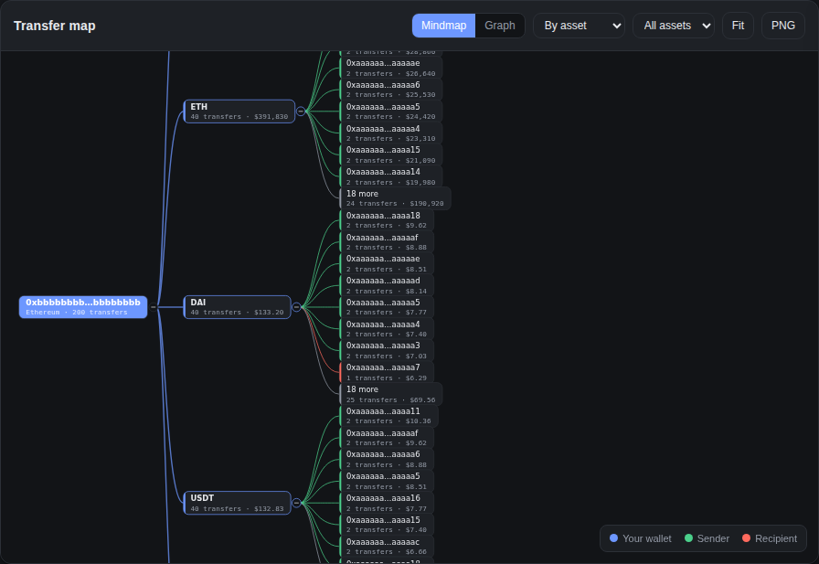
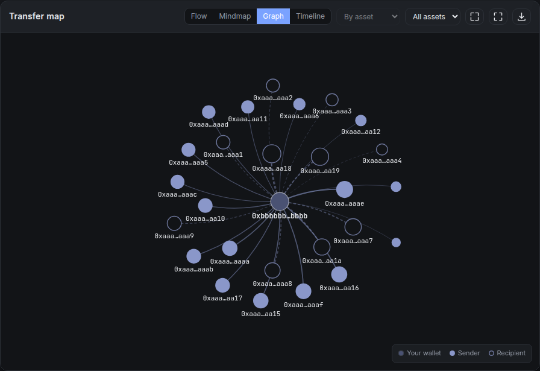
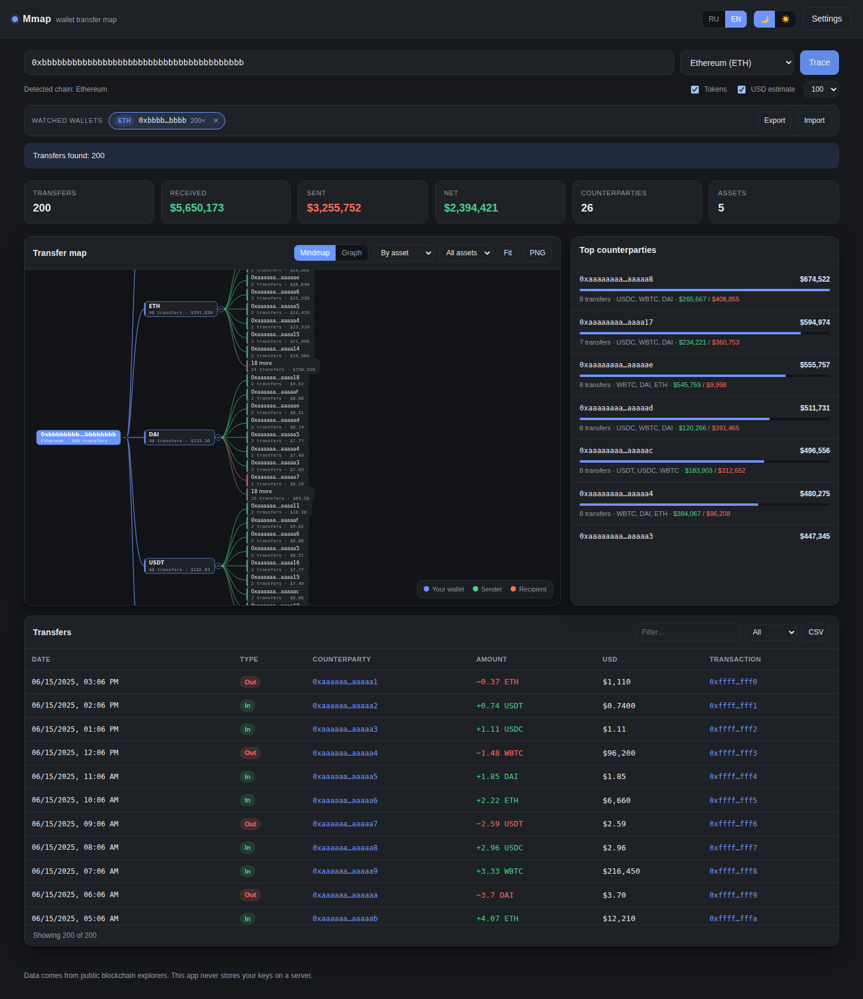
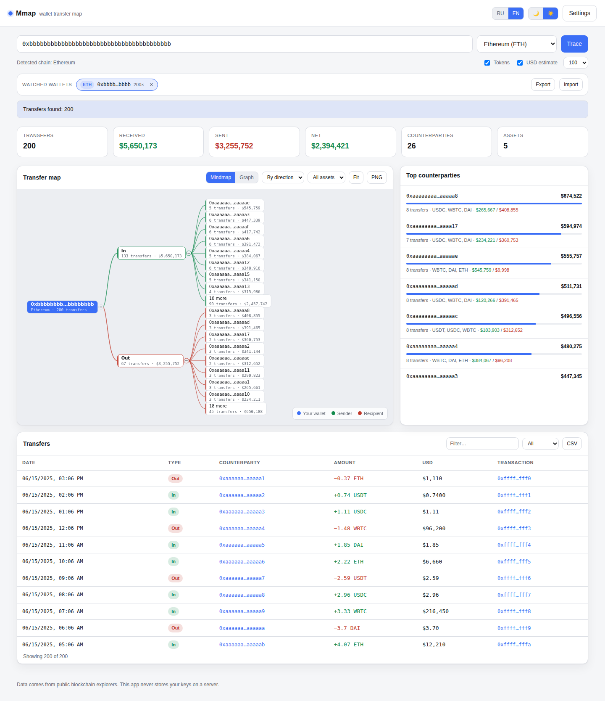

<h1 align="center">Mmap</h1>
<p align="center">
  <b>Карта переводов криптокошелька · Crypto wallet transfer map</b><br>
  Вставь адрес — получи схему всех переводов: кто, кому, сколько, в какой монете и на сколько долларов.
</p>

<p align="center">
  
</p>

<p align="center">
  
  
  
  
  
</p>

---

## Запуск через Docker / Running with Docker

Единственный поддерживаемый способ запуска. Нужен только Docker.

```bash
git clone https://github.com/SpecFlowdev/Mmap.git
cd Mmap
docker compose up -d --build
```

Панель открывается на **http://localhost:8080**.

Другой порт — переменной окружения:

```bash
MMAP_PORT=9000 docker compose up -d --build   # http://localhost:9000
```

Управление:

```bash
docker compose logs -f     # логи
docker compose restart     # перезапуск
docker compose down        # остановить и удалить контейнер
```

Без compose, напрямую:

```bash
docker build -t mmap .
docker run -d --name mmap -p 8080:80 --restart unless-stopped mmap
```

Внутри — `nginx:alpine`, отдающий статику; сборки фронтенда нет, образ весит несколько мегабайт.
Порт контейнера — 80, наружу пробрасывается 8080. Здоровье контейнера проверяется `HEALTHCHECK`,
состояние видно в `docker ps`.

## Два вида схемы / Two map modes

<table>
  <tr>
    <td align="center"><b>Майндмап · группировка по активам</b></td>
    <td align="center"><b>Граф · force-directed</b></td>
  </tr>
  <tr>
    <td></td>
    <td></td>
  </tr>
</table>

## Скриншоты / Screenshots

<table>
  <tr>
    <td align="center"><b>Тёмная тема · русский</b></td>
    <td align="center"><b>Light theme · English</b></td>
  </tr>
  <tr>
    <td></td>
    <td></td>
  </tr>
</table>

## Возможности / Features

- **Два вида схемы, переключаются одной кнопкой:**
  - **Майндмап** (по умолчанию) — дерево слева направо: кошелёк → группы → контрагенты.
    Группировать можно **по активам** (ETH, USDT, WBTC…) или **по направлению** (входящие / исходящие).
    Ветки сворачиваются кружком «−», в каждой ветке 8 крупнейших контрагентов, остальные — в узле «ещё N».
    У каждого узла подпись: число операций и сумма в USD.
  - **Граф** — force-directed схема: в центре кошелёк, вокруг контрагенты,
    размер узла и толщина связи = оборот, цвет = направление, узлы перетаскиваются.
  - В обоих: зум колесом, панорама перетаскиванием, экспорт в PNG, клик по контрагенту фильтрует таблицу.
- **Сохранение отслеживаемых кошельков** — каждый просканированный адрес попадает в панель
  «Отслеживаемые кошельки»: клик по чипу мгновенно открывает кошелёк заново, крестик убирает его.
  Список переживает перезапуск контейнера, переносится между машинами через **Экспорт / Импорт** JSON.
- **12 сетей**: Bitcoin, Litecoin, Dogecoin, Tron (TRX + TRC-20), Solana (SOL + SPL) и EVM —
  Ethereum, BNB Chain, Polygon, Arbitrum, Optimism, Base, Avalanche (нативные монеты + ERC-20).
- **Автоопределение сети** по формату адреса — вставка адреса другой сети переключает выбор сама.
- **Оценка в USD** по курсам CoinGecko, стейблкоины считаются как $1.
- **Статистика**: число переводов, получено / отправлено / итого в USD, контрагенты, активы.
- **Таблица** с сортировкой, фильтром по тексту и направлению, ссылками в обозреватель, выгрузкой в CSV.
- **Русский и английский** язык, **тёмная серая** и **светлая** темы — выбор сохраняется.
- **Deep link**: `http://localhost:8080/#ethereum:0xabc…` открывает адрес сразу.

## Ключи API / API keys

Вводятся в «Настройках» прямо в интерфейсе. Хранятся **только** в `localStorage` браузера
и уходят напрямую в API провайдера — сервера у приложения нет, ключи не попадают ни в образ,
ни в логи nginx.

| Сеть | Провайдер | Ключ |
|---|---|---|
| EVM (все семь) | Etherscan V2 multichain | **обязателен**, бесплатный на etherscan.io |
| Tron | TronGrid | необязателен (без ключа лимит ниже) |
| Solana | JSON-RPC | по умолчанию публичная нода, можно указать свою |
| Bitcoin | mempool.space | не нужен |
| Litecoin / Dogecoin | Blockchair | не нужен |

## Где что лежит / Layout

```
Dockerfile                образ на nginx:alpine
docker-compose.yml        запуск одной командой, порт через MMAP_PORT
docker/nginx.conf         раздача статики, заголовки кэша и безопасности
index.html
assets/css/styles.css     темы на CSS-переменных (тёмная / светлая)
assets/js/i18n.js         словари RU/EN и подстановка в DOM
assets/js/utils.js        форматирование, точное деление на 10^decimals, fetch с ретраями
assets/js/prices.js       курсы CoinGecko + кэш
assets/js/providers.js    адаптеры блокчейнов → единый формат перевода
assets/js/graph.js        force-directed граф на canvas
assets/js/mindmap.js      майндмап-дерево на canvas со сворачиванием веток
assets/js/app.js          состояние, список кошельков, агрегация, рендер
```

## Хранение данных / Data storage

Всё состояние — список кошельков, ключи API, язык и тема — лежит в `localStorage` браузера,
а не в контейнере. Поэтому `docker compose down` ничего не теряет, но список привязан к браузеру:
для переноса на другую машину пользуйся кнопкой **Экспорт**.

## Ограничения / Limitations

- Данные читаются постранично, глубина ограничена выбранным лимитом (50–500 последних операций).
- USD считается по **текущему** курсу, а не по курсу на момент транзакции.
- Цена определяется для известных тикеров; малоликвидные токены остаются без USD-оценки.
- Litecoin/Dogecoin Blockchair отдаёт агрегированно (изменение баланса за транзакцию),
  без разбивки по конкретным контрагентам.
- Solana: разбираются system- и SPL-переводы; сложные программные инструкции не декодируются.
